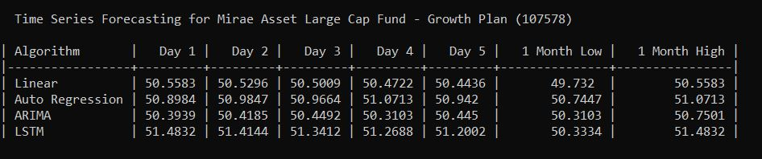
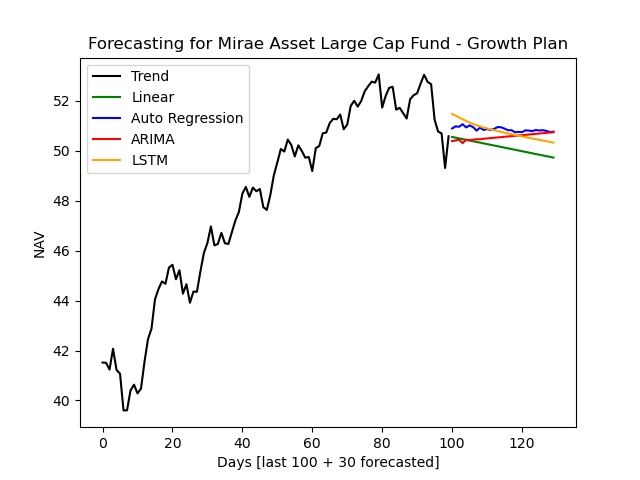

Forecasting_Mutual_Funds
=====================

This Project gives you an overall idea for Forecasting Mutual Funds


<!--- --->

Introduction
============

* Project performs forecasting by using different Time Series algorithms.
* This gives you an overall idea about how each algorithm forecast same mutual fund.
* Performs Next 30 days forecasting.
  

Installation
=============
Clone this repository and install the requirements.


Pre-Requisite
==============
Project required Mutual fund scheme code, *[here](https://raw.githubusercontent.com/NayakwadiS/mftool/master/Scheme_codes.txt)* you can get those. 


Steps to Execute
=================
1. Direct to cloned repository path in CMD or Terminal
2. Run main.py 
```shell
  >>D:\Forecasting_Mutual_Funds> python main.py
```
3. Enter Mutual Fund Scheme code you want to Forecast
```shell
  >>Enter the MF Scheme code:- MF code
```
4. Wait a minute to get the result as 





Disclaimer
================
This is study project which gives an idea about MF forecasting and should not be considered as investment advice.


To Do
================
Creation of Webapp 


