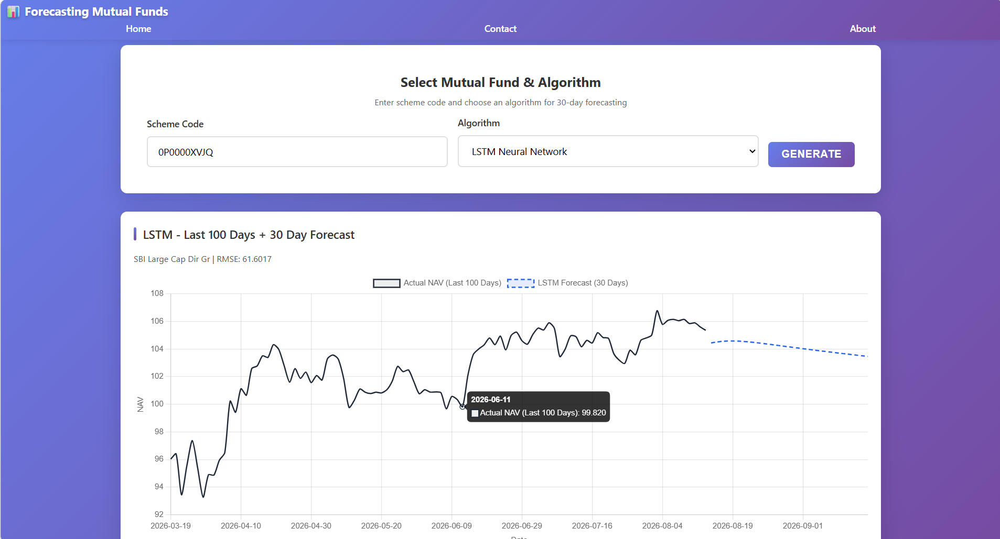
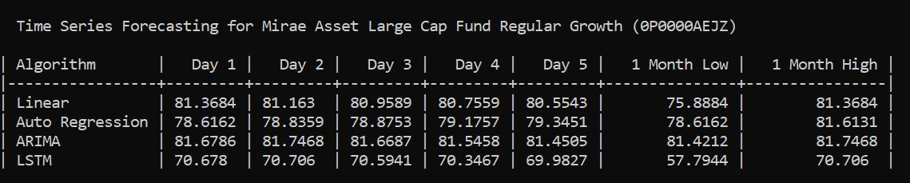
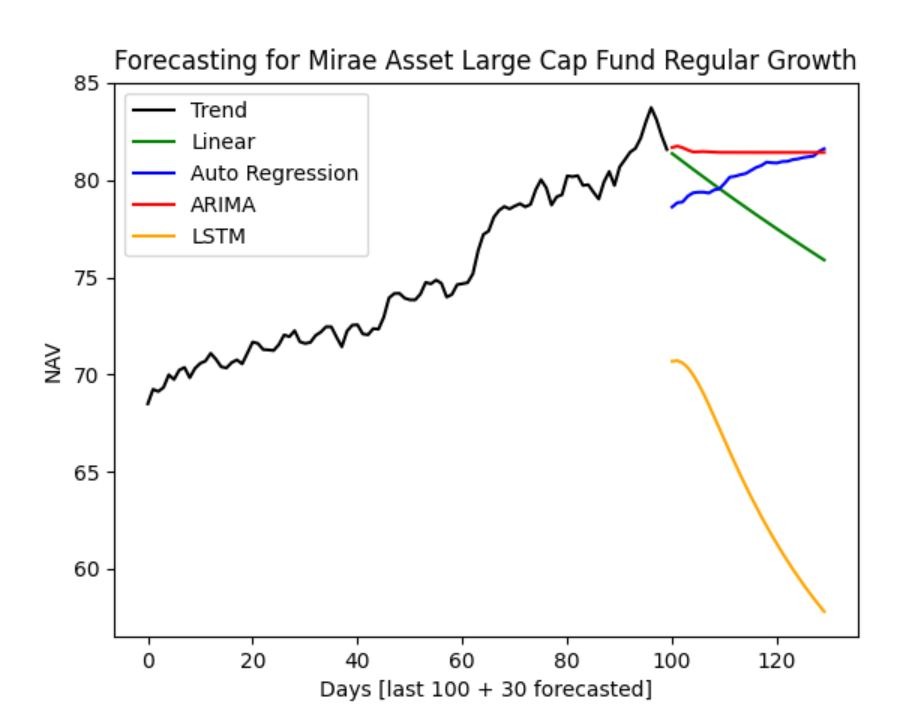

# Forecasting Mutual Funds

A simple project to forecast mutual fund NAV using multiple time-series algorithms.


[](https://github.com/NayakwadiS/NSE-Neuron/stargazers)

## UI (Recommended)

Use the web UI for the best experience.

### Steps to start UI
1. Open terminal in project folder.
2. Run `start.bat`.
3. Open `http://localhost:5000/`.
4. Enter Scheme Code, choose algorithm, and generate forecast.



## Run from Terminal

1. Direct to cloned repository path in CMD or Terminal
2. Run `main.py`
```shell
>>D:\Forecasting_Mutual_Funds> python main.py
```
3. Enter Mutual Fund Scheme code you want to Forecast
```shell
>>Enter the MF Scheme code:- MF code
```
4. Wait a minute to get the result as




## Pre-Requisite

You need a valid mutual fund scheme code. You can get codes from:
*[codes.json](https://github.com/NayakwadiS/Forecasting_Mutual_Funds/blob/master/codes.json)*

## Disclaimer

This project is for learning and demonstration only. It is not investment advice.

## Related Project

Crypto prediction in INR:
*[Predict_Cryptocurrency_INR](https://github.com/NayakwadiS/Predict_Cryptocurrency_INR)*
