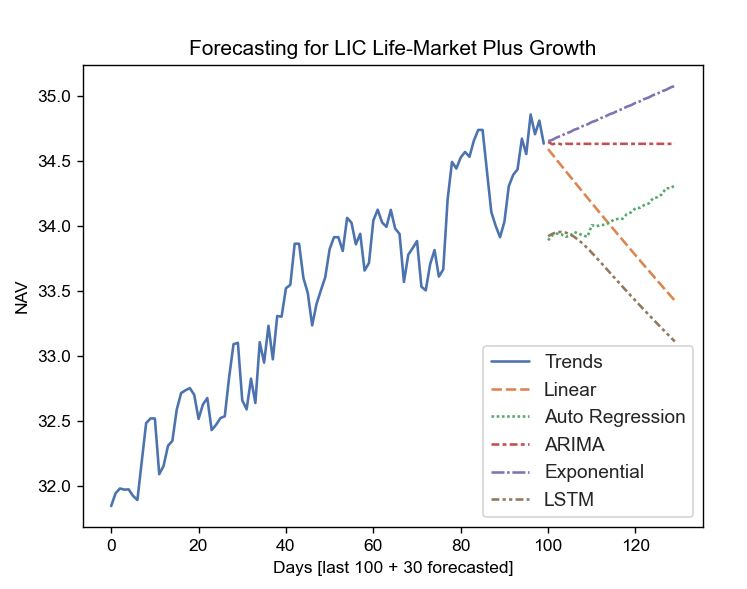

This Project gives you an overall idea for Forecasting Mutual Funds.


<!--- --->

Introduction
============
* Project performs forecasting by using different Time Series algorithms.
* This gives you an overall idea about how each algorithm forecast same mutual fund.
* Performs Next 30 days forecasting.
  

Installation
=============
Clone this repository and install the requirements.


Pre-Requisite
==============
Project required Mutual fund scheme code, *[here](https://github.com/NayakwadiS/Forecasting_Mutual_Funds/blob/master/codes.json)* you can get those. 


Steps to Run from Terminal
=================
1. Direct to cloned repository path in CMD or Terminal
2. Run main.py 
```shell
  >>D:\Forecasting_Mutual_Funds> python main.py
```
3. Enter Mutual Fund Scheme code you want to Forecast
```shell
  >>Enter the MF Scheme code:- MF code
```
4. Wait a minute to get the result as 





Steps to Run as Web App
=================
1. Direct to cloned repository path and Run app.py
2. Navigate to http://localhost:5000/
3. Enter Scheme code, select Algorithm and click View


Disclaimer
================
This project gives an idea about MF forecasting and should not be considered as investment advice.


Crypto Prediction
================
Prediction of Cryptocurrencies in Indian Rupees *[here](https://github.com/NayakwadiS/Predict_Cryptocurrency_INR)*


